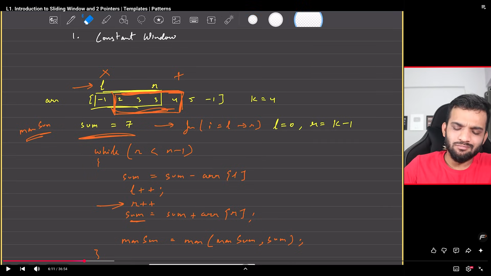
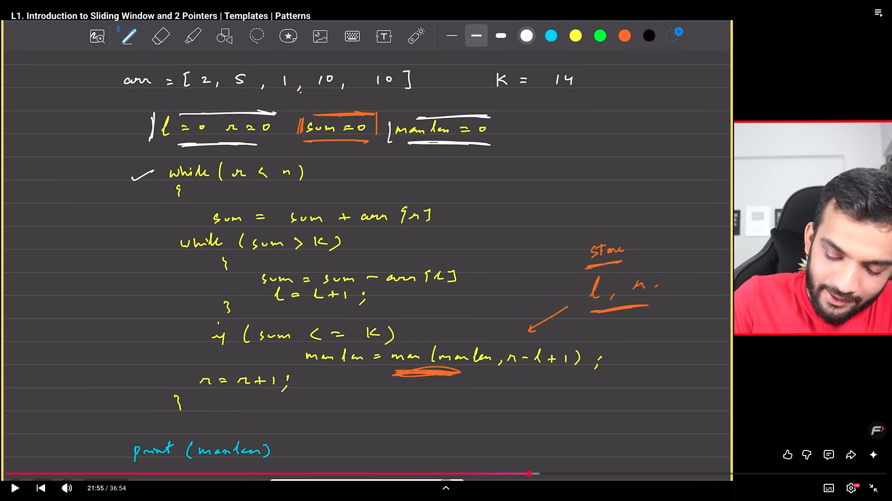
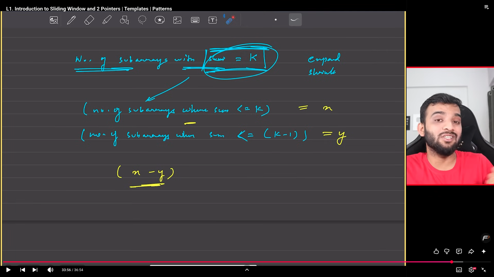
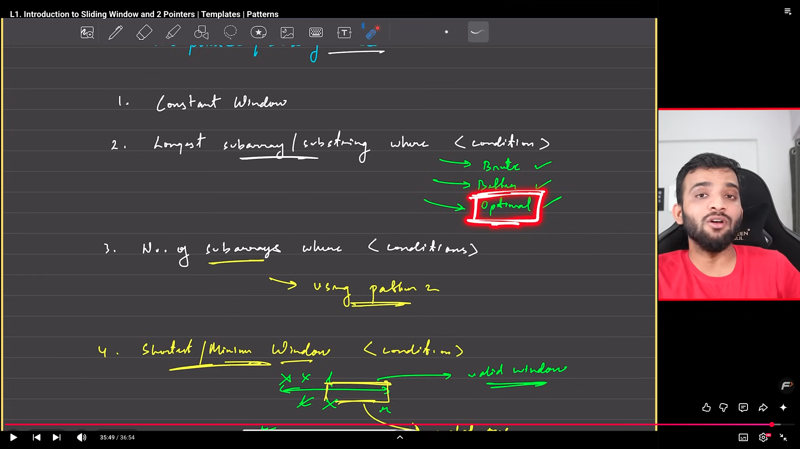

##Constant Window Template

-> we first try to calculate the sum of anything of a particaular window and then keep shifting the window by one everytime

##Longest subarray/substring where <condition>
->start with window size 1 and keep following the shrink and expand rule depending on your condition

##No of Subarrays with constant fixes condition like sum=k
-> In that case we tend to find no which are less than equal and no which is greater and then subtract to get the answer becoz we dont know whether to shrink or to expand

Most problems here revolve around the 
-> Generatiing subarrays ( Brute )
-> Expanding and Shrinking
-> Generating subarrays

